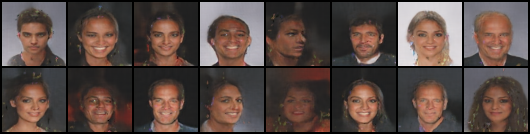

# PyTorch Implementation of BEGAN

PyTorch Implementation of [BEGAN: Boundary Equilibrium Generative Adversarial Networks](https://arxiv.org/abs/1703.10717).

## Prerequisites
- PyTorch
- torchvision

## Training
- Download [CelebA](http://mmlab.ie.cuhk.edu.hk/projects/CelebA.html), choose the `Aligh&Croped Images` zip. Unzip it and put it under `data/` directory.
- Training
  ```
  python began.py --cuda
  ```

## Generate
  ```
  python generate.py --netG dcgan/netG.pth --batchSize 16
  ```
- γ = 0.5, 64 x 64



## Reference
1. [https://github.com/carpedm20/BEGAN-tensorflow](https://github.com/carpedm20/BEGAN-tensorflow)
2. Berthelot, David, Tom Schumm, and Luke Metz. "BEGAN: Boundary Equilibrium Generative Adversarial Networks." arXiv preprint arXiv:1703.10717 (2017).
