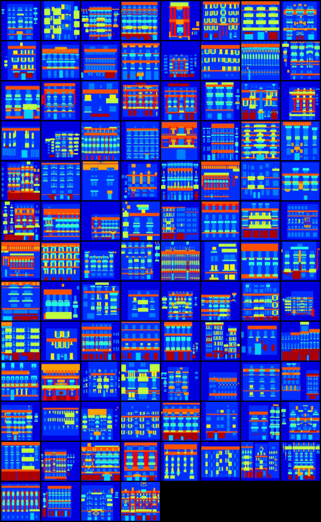
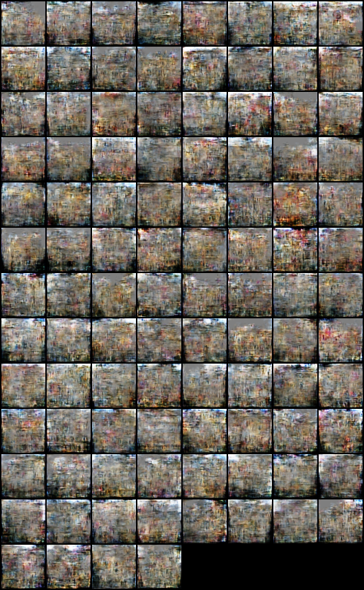
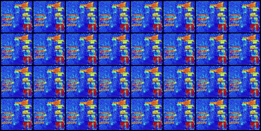

# PyTorch Implementation of DiscoGAN

PyTorch implementation of [Learning to Discover Cross-Domain Relations with Generative Adversarial Networks](https://arxiv.org/abs/1703.05192) on the Facades dataset.

## Prerequisites
- PyTorch
- torchvision

## DATASET

  In the `DiscoGAN` folder, run:
  ```
  wget https://people.eecs.berkeley.edu/~tinghuiz/projects/pix2pix/datasets/facades.tar.gz
  tar -zxvf facades.tar.gz
  ```
  Go to scripts folder, run:
  ```
  python PrepareDataset.py --dataPath ../facades
  ```
  This script will split paired training image into unpaired training images. At the end of this script, it will ask you whether to delete original paired data in order to save disk space, please be aware that deleted data is unrecoverable.
  
## Training
  ```
  python DiscoGAN.py --cuda
  ```

## Generate
  ```
  python generate.py --G_AB checkpoints/G_AB_2000.pth --G_BA checkpoints/G_BA_2000.pth -cuda
  ```

- Generations:





## Reference
1. [https://github.com/carpedm20/DiscoGAN-pytorch](https://github.com/carpedm20/DiscoGAN-pytorch)
2. Kim T, Cha M, Kim H, et al. Learning to Discover Cross-Domain Relations with Generative Adversarial Networks[J]. arXiv preprint arXiv:1703.05192, 2017.
