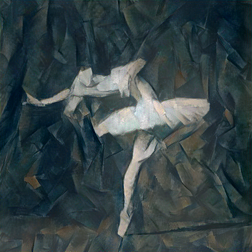
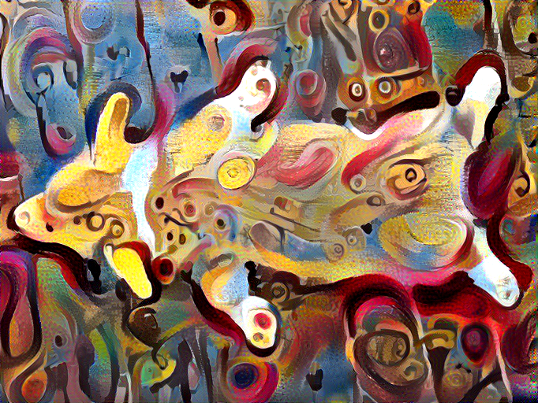
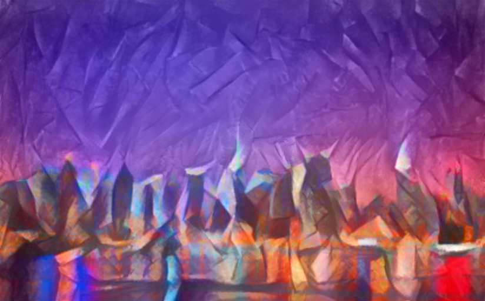
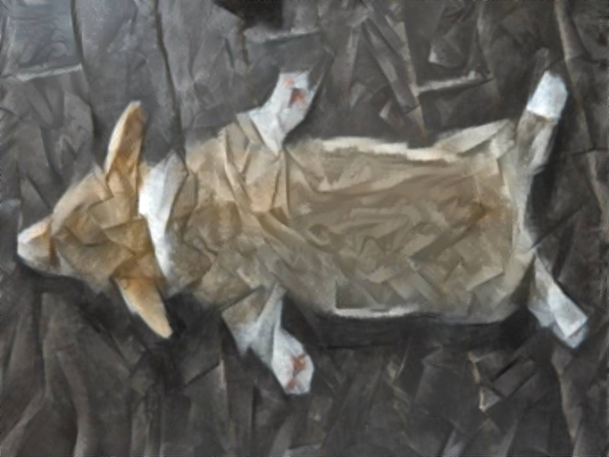

# PyTorch Implementation of Neural Style Transfer Algorithms

- [Image Style Transfer Using Convolutional Neural Networks](#neural-style-transfer)

- [Preserving Color in Neural Artistic Style Transfer](#neural-style-transfer-with-color-preservation)

- [Style Transfer by Aligning the BN Statistics (mean and standard deviation)](#neural-style-transfer-by-aligning-the-bn-statistics)

**This code heavily borrows from [https://github.com/leongatys/PytorchNeuralStyleTransfer](https://github.com/leongatys/PytorchNeuralStyleTransfer), which is an elegant example to show how to extract intermediate features from pre-trained models in PyTorch**

## Prerequisites
- PyTorch
- torchvision

## Downloading Pre-trained VGG model
  ```
  mkdir models && cd models
  wget -c --no-check-certificate https://bethgelab.org/media/uploads/pytorch_models/vgg_conv.pth
  cd ..
  ```
## Neural Style Transfer 
  This section implements the paper [Image Style Transfer Using Convolutional Neural Networks](http://www.cv-foundation.org/openaccess/content_cvpr_2016/papers/Gatys_Image_Style_Transfer_CVPR_2016_paper.pdf)
  ```
  python neuralStyle.py --cuda
  ```
    

    

## Neural Style Transfer by aligning the BN statistics 
   This implements the loss proposed in [Demystifying Neural Style Transfer](https://arxiv.org/pdf/1701.01036.pdf) as shown below. It gives comparable performance with style transfer by matching Gram Matricies.
   
   
   
   ```
   python train.py --cuda --BNMatching --niter 40 --style_weight 50 --content_weight 1
   ```
     
   
## Neural Style Transfer with Color Preservation

   This section implements [Preserving Color in Neural Artistic Style Transfer](https://arxiv.org/abs/1606.05897). [Color Histogram Transfer algorithm](https://github.com/sunshineatnoon/Paper-Implementations/blob/master/NeuralSytleTransfer/util.py#L15) is copied from [chainer-neural-style](https://github.com/dsanno/chainer-neural-style/blob/master/src/util.py#L99).
   
   **Approach I: Color Histogram Matching**

   ```
   python train.py --style_image images/picasso.jpg --content_image images/NY.png --content_weight 500 --style_weight 1 --cuda --color_histogram_matching
   ```
     

   **Approach II: Luminance-only Neural Style Transfer**
   ```
   python train.py --style_image images/picasso.jpg --content_image images/NY.png --cuda --luminance_only
   ```
     

    

**Train on CPU: leave out the `--cuda` parameter**

Transferred image will be stored as `images/transfer.png`


## Reference
1. [https://github.com/leongatys/PytorchNeuralStyleTransfer](https://github.com/leongatys/PytorchNeuralStyleTransfer)
2. [https://github.com/dsanno/chainer-neural-style](https://github.com/dsanno/chainer-neural-style)
