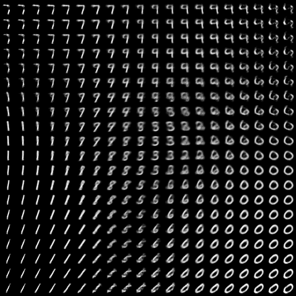
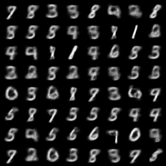
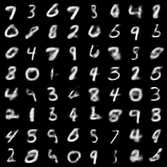
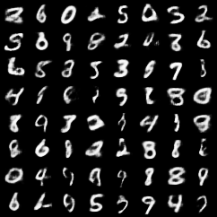

# PyTorch Implementation of [[Auto-Encoding Variational Bayes]](https://arxiv.org/pdf/1312.6114.pdf)

## Prerequisites
- PyTorch
- torchvision

## Training
- Train on MNIST
  ```
  python vae.py --cuda --hidden_size 2
  ```
  During training, samples generated from random normal Gaussian distribution will be saved under folder `samples`.
  `hidden_size` is the dimension of `z`, if `hidden_size=2`, an interpolation image will be generated at the end of the last epoch, shown as below:
  
  

## Image Quality w.r.t Hidden Size
I observed that larger `hidden_size` gives shaper but harder to recognize images, while smaller `hidden_size` gives more blur but easier to recognize images, shown as below(From left to right is 2D, 5D, 10D `hidden_size`). My guess is that a 2-dimensional Gaussian is much easier to approximate than a 20-dimensional Gaussian, while smaller `hidden_size` blocks lots of information going through the auto-encoder.

  

## Reference
1. [https://github.com/yunjey/pytorch-tutorial](https://github.com/yunjey/pytorch-tutorial)
2. [https://github.com/pytorch/examples](https://github.com/pytorch/examples)
