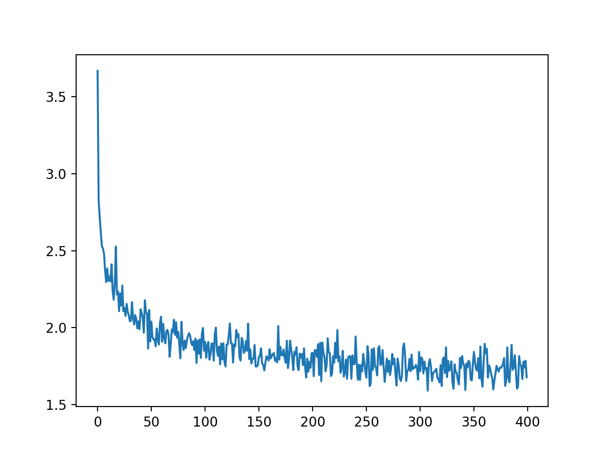

## PyTorch implementation of Char RNN

## Prerequisites
- PyTorch
- matplotlib
- codecs

## Training & Evaluation
```
python train.py
```

**Loss**



**Generation**

Thing of the sanally from to be and Harry, and the been Hermione as he cood stared be a be the Snapes enought the got to the Snape of the firthent in the been you back of and so the be onestane about co

## Reference
[https://github.com/spro/practical-pytorch/blob/master/char-rnn-generation/char-rnn-generation.ipynb](https://github.com/spro/practical-pytorch/blob/master/char-rnn-generation/char-rnn-generation.ipynb)
