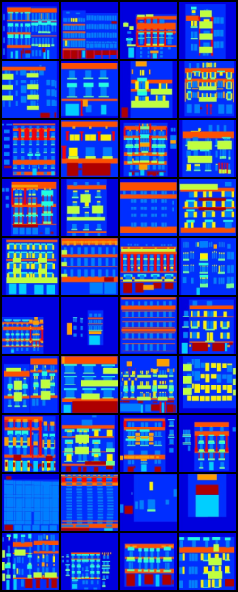
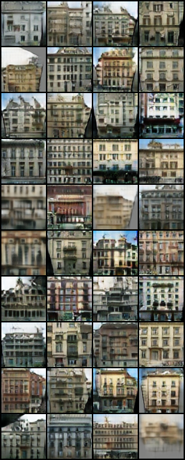
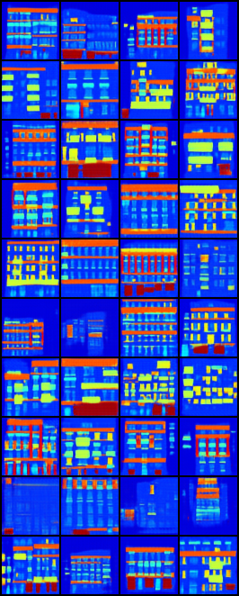
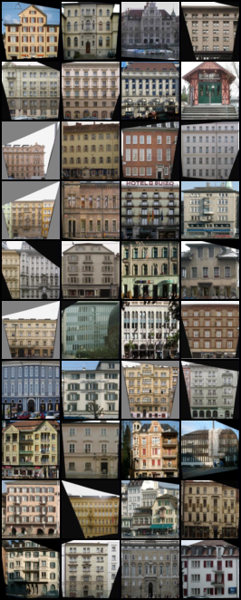
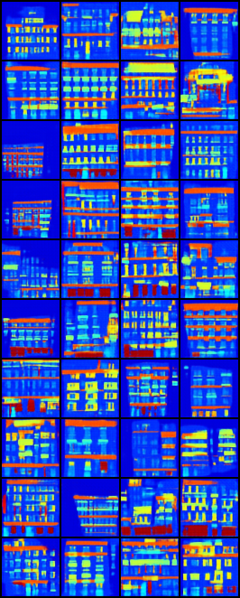
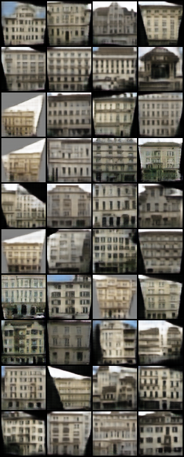

# PyTorch Implementation of DiscoGAN

PyTorch implementation of [Unpaired Image-to-Image Translation using Cycle-Consistent Adversarial Networks](https://junyanz.github.io/CycleGAN/) on the Facades dataset.

## Prerequisites
- PyTorch
- torchvision

## DATASET

  In the `CycleGAN` folder, run:
  ```
  wget https://people.eecs.berkeley.edu/~tinghuiz/projects/pix2pix/datasets/facades.tar.gz
  tar -zxvf facades.tar.gz
  rm facades.tar.gz
  ```
  Go to the `scripts` folder and run:
  ```
  python PrepareDataset.py --dataPath ../facades
  ```

  This script will split paired training image into unpaired training images. At the end of this script, it will ask you whether to delete original paired data in order to save disk space, please be aware that deleted data is unrecoverable.

## Training
  ```
  python CycleGAN.py --cuda
  ```

## Generate
  ```
  python generate.py --G_AB checkpoints/G_AB_40000.pth --G_BA checkpoints/G_BA_40000.pth -cuda --dataPath facades/val/
  ```
To train or generate on other dataset, change `dataPath` accordingly.

- Generations:

**A -> B -> A**

    

**B -> A -> B**

    

## Reference
1. [https://github.com/junyanz/CycleGAN](https://github.com/junyanz/CycleGAN)
2. Zhu J Y, Park T, Isola P, et al. Unpaired Image-to-Image Translation using Cycle-Consistent Adversarial Networks[J]. arXiv preprint arXiv:1703.10593, 2017.

