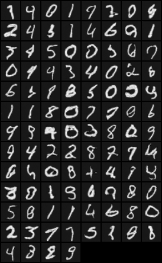
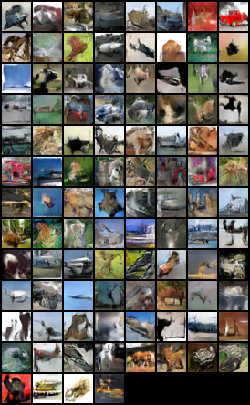

# PyTorch Implementation of DCGAN

## Prerequisites
- PyTorch
- torchvision

## Training
- Train on MNIST
  ```
  python dcgan.py --cuda --dataset MNIST
  ```
- Train on CIFAR
  ```
  python dcgan.py --cuda --dataset CIFAR
  ```
**Train on CPU: leave out the `--cuda` parameter**

## Generate
- Generate MNIST
  ```
  python generate.py --netG dcgan/MNIST.pth --batchSize 100 --dataset MNIST
  ```
- Generate CIFAR
  ```
  python generate.py --netG dcgan/CIFAR.pth --batchSize 100 --dataset CIFAR
  ```
 

## Reference
1. [https://github.com/yunjey/pytorch-tutorial](https://github.com/yunjey/pytorch-tutorial)
2. [https://github.com/pytorch/examples](https://github.com/pytorch/examples)
