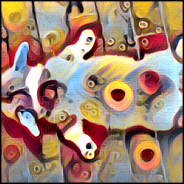
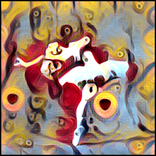

# PyTorch Implementation of Fast Neural Style Transfer
PyTorch implementation of [Perceptual Losses for Real-Time Style Transfer
and Super-Resolution](http://cs.stanford.edu/people/jcjohns/papers/eccv16/JohnsonECCV16.pdf)

## Prerequisites
- PyTorch
- torchvision

## Downloading Pre-trained VGG model
  ```
  mkdir models && cd models
  wget -c --no-check-certificate https://bethgelab.org/media/uploads/pytorch_models/vgg_conv.pth
  cd ..
  ```
## Fast Style Transfer Using Pre-trained Model
  - Download pre-trained model (for the candy style shown below) from [Google Drive](https://drive.google.com/file/d/0B7ubsKiIWH8-T3hyV1k0al91WDg/view?usp=sharing). 
  - Run:
  
    ```
    python test.py --transform_net images/transform_net.pth --content_image images/corgi.jpg
    ```
      

## Training
   - Download [MS COCO Dataset](http://mscoco.org/dataset/#download)
   - unzip it to a `data/` folder, so your directory looks like:
     ```
     - data
       - train2014
       - annotations
       - val2014
      ```
   - Run:
     ```
     python train.py --cuda --style_image images/picasso.jpg --dataPath ~/path to MS coco/data --style_image images/candy.jpg
     ```


## Reference
1. [https://github.com/darkstar112358/fast-neural-style](https://github.com/darkstar112358/fast-neural-style)
2. Johnson, Justin, Alexandre Alahi, and Li Fei-Fei. "Perceptual losses for real-time style transfer and super-resolution." European Conference on Computer Vision. Springer International Publishing, 2016.
