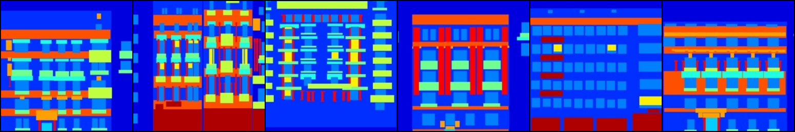
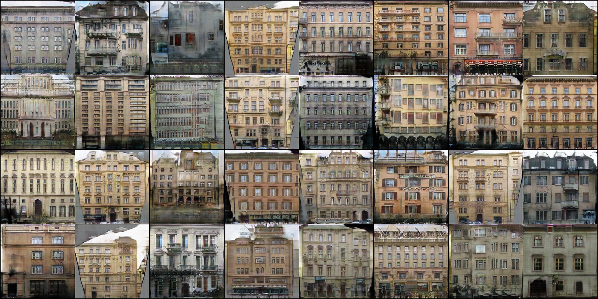
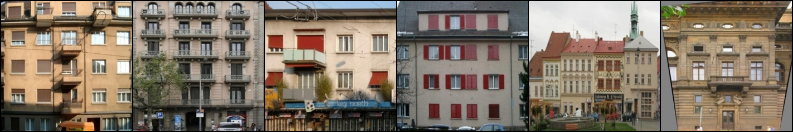
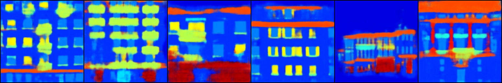

# PyTorch Implementation of pix2pix

PyTorch implementation of [Image-to-Image Translation Using Conditional Adversarial Networks](https://arxiv.org/pdf/1611.07004v1.pdf) on the Facades dataset.

## Prerequisites
- PyTorch
- torchvision

## DATASET

  In the `pix2pix` folder, run:
  ```
  wget https://people.eecs.berkeley.edu/~tinghuiz/projects/pix2pix/datasets/facades.tar.gz
  tar -zxvf facades.tar.gz
  ```
## Training
  ```
  python train.py --cuda
  ```

## Generate
  ```
  python generate.py --netG checkpoints/netG.pth --cuda --which_direction AtoB
  ```
- From A to B:
 

- From B to A:
 

**The image generated is not as good as the official torch implementation, I will continue to address this issue.**

## Reference
1. [https://github.com/phillipi/pix2pix](https://github.com/phillipi/pix2pix)
2. [https://github.com/mrzhu-cool/pix2pix-pytorch](https://github.com/mrzhu-cool/pix2pix-pytorch)
3. Isola, Phillip, et al. "Image-to-image translation with conditional adversarial networks." arXiv preprint arXiv:1611.07004 (2016).
